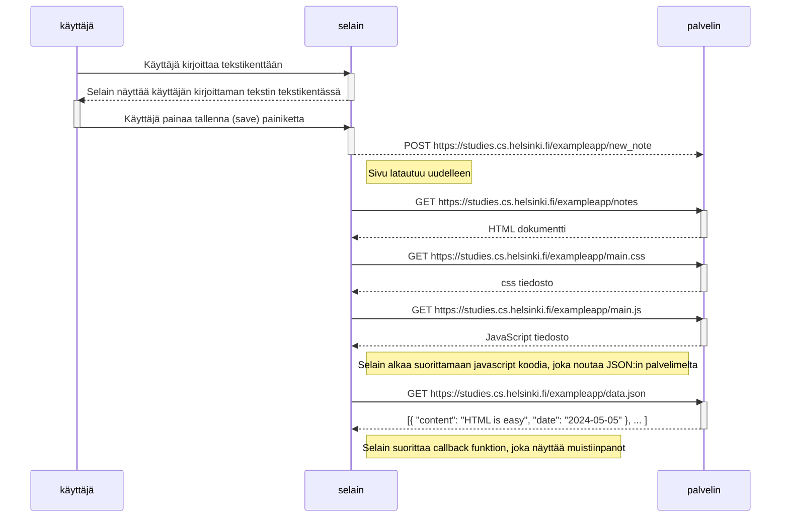

```mermaid
    sequenceDiagram
	participant käyttäjä
        participant selain
        participant palvelin
        
        käyttäjä->>selain: Käyttäjä kirjoittaa tekstikenttään
        activate selain
        selain-->>käyttäjä: Selain näyttää käyttäjän kirjoittaman tekstin tekstikentässä
        deactivate selain
	activate käyttäjä
        
        käyttäjä->>selain: Käyttäjä painaa tallenna (save) painiketta
	deactivate käyttäjä
        activate selain
        selain-->>palvelin: POST https://studies.cs.helsinki.fi/exampleapp/new_note
        deactivate selain

	Note right of selain: Sivu latautuu uudelleen
	
	selain->>palvelin: GET https://studies.cs.helsinki.fi/exampleapp/notes
	activate palvelin
	palvelin-->>selain: HTML dokumentti
	deactivate palvelin
	    
	selain->>palvelin: GET https://studies.cs.helsinki.fi/exampleapp/main.css
	activate palvelin
	palvelin-->>selain: css tiedosto
	deactivate palvelin
	    
	selain->>palvelin: GET https://studies.cs.helsinki.fi/exampleapp/main.js
	activate palvelin
	palvelin-->>selain: JavaScript tiedosto
	deactivate palvelin
	    
	Note right of selain: Selain alkaa suorittamaan javascript koodia, joka noutaa JSON:in palvelimelta
	    
	selain->>palvelin: GET https://studies.cs.helsinki.fi/exampleapp/data.json
	activate palvelin
	palvelin-->>selain: [{ "content": "HTML is easy", "date": "2024-05-05" }, ... ]
	deactivate palvelin    
	
	Note right of selain: Selain suorittaa callback funktion, joka näyttää muistiinpanot
```
