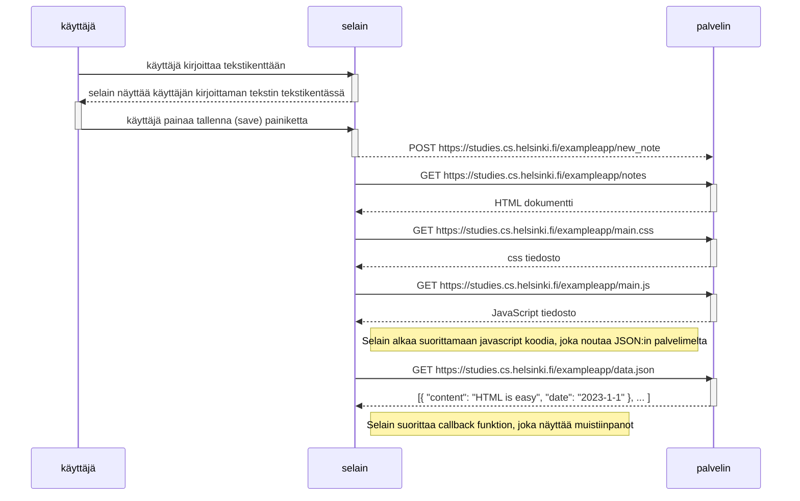

```mermaid
    sequenceDiagram
		participant käyttäjä
        participant selain
        participant palvelin
        
        käyttäjä->>selain: käyttäjä kirjoittaa tekstikenttään
        activate selain
        selain-->>käyttäjä: selain näyttää käyttäjän kirjoittaman tekstin tekstikentässä
        deactivate selain
		activate käyttäjä
        
        käyttäjä->>selain: käyttäjä painaa tallenna (save) painiketta
		deactivate käyttäjä
        activate selain
        selain-->>palvelin: POST https://studies.cs.helsinki.fi/exampleapp/new_note
        deactivate selain
		
		selain->>palvelin: GET https://studies.cs.helsinki.fi/exampleapp/notes
	    activate palvelin
	    palvelin-->>selain: HTML dokumentti
	    deactivate palvelin
	    
	    selain->>palvelin: GET https://studies.cs.helsinki.fi/exampleapp/main.css
	    activate palvelin
	    palvelin-->>selain: css tiedosto
	    deactivate palvelin
	    
	    selain->>palvelin: GET https://studies.cs.helsinki.fi/exampleapp/main.js
	    activate palvelin
	    palvelin-->>selain: JavaScript tiedosto
	    deactivate palvelin
	    
	    Note right of selain: Selain alkaa suorittamaan javascript koodia, joka noutaa JSON:in palvelimelta
	    
	    selain->>palvelin: GET https://studies.cs.helsinki.fi/exampleapp/data.json
	    activate palvelin
	    palvelin-->>selain: [{ "content": "HTML is easy", "date": "2023-1-1" }, ... ]
	    deactivate palvelin    
	
	    Note right of selain: Selain suorittaa callback funktion, joka näyttää muistiinpanot
```
