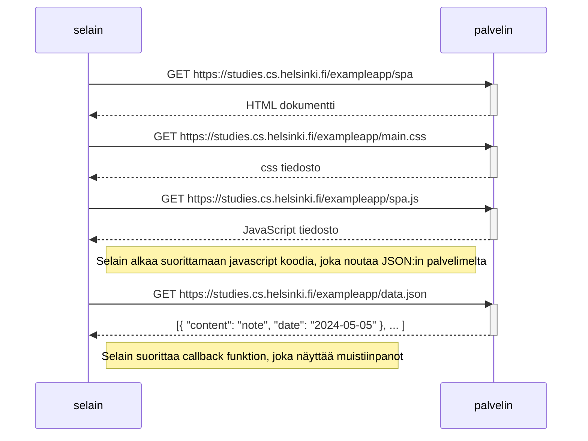

```mermaid
    sequenceDiagram
        participant selain
        participant palvelin
        
		selain->>palvelin: GET https://studies.cs.helsinki.fi/exampleapp/spa
		activate palvelin
		palvelin-->>selain: HTML dokumentti
		deactivate palvelin
	    
		selain->>palvelin: GET https://studies.cs.helsinki.fi/exampleapp/main.css
		activate palvelin
		palvelin-->>selain: css tiedosto
		deactivate palvelin
	    
		selain->>palvelin: GET https://studies.cs.helsinki.fi/exampleapp/spa.js
		activate palvelin
		palvelin-->>selain: JavaScript tiedosto
		deactivate palvelin
	    
		Note right of selain: Selain alkaa suorittamaan javascript koodia, joka noutaa JSON:in palvelimelta
	    
		selain->>palvelin: GET https://studies.cs.helsinki.fi/exampleapp/data.json
		activate palvelin
		palvelin-->>selain: [{ "content": "note", "date": "2024-05-05" }, ... ]
		deactivate palvelin    
	
		Note right of selain: Selain suorittaa callback funktion, joka näyttää muistiinpanot
```
